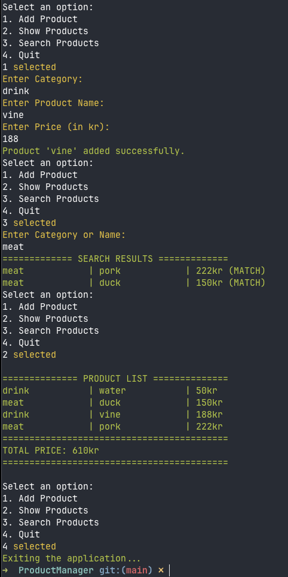

# ProductManager

A C# console application designed to manage products, categories, and inventory. Developed as part of Checkpoint 2 for C# programming studies.

## Features
- **Dynamic Product Entry**: Continuous input for product category, name, and price until quit.
- **Data Validation & Error Handling**: Validates empty inputs, non-numeric prices, and non positive price values.
- **LINQ Integration**: Automatically sorts products from lowest to highest price and calculates total cost.
- **Search & Highlight (Level 4)**: Search products by name or category with matched results highlighted in green.

## Technologies
- **Language**: C# (.NET 8.0 / .NET Core)
- **Paradigm**: Object-Oriented Programming (OOP)
- **Features Used**: LINQ, System.Collections.Generic, Console UI

## Installation
- Install the .NET SDK on your machine.
- Clone this repository:
```Bash
git clone [https://github.com/vickytttt/c-sh-study.git](https://github.com/vickytttt/c-sh-study.git)
```

## How to Run
1. Open your terminal and navigate to the project:
```Bash
cd c-sh-study/ProductManager
```
2. Run the `ProductManager` project using .NET CLI:
```bash
   clear && dotnet run --project ProductManager
```
3. Navigate the menu to enter product details (Category, Name, Price) one by one
4. Select other options to view the sorted list with the total price, run a search or quit.

## Screenshots


## Team Members
- vickytttt - ```https://github.com/vickytttt```

## Future Improvements
- Implement Level 5 features: Product IDs, Edit/Delete options, JSON file persistence.
- Add pagination and advanced filtering options.
- Export summaries to external text files.